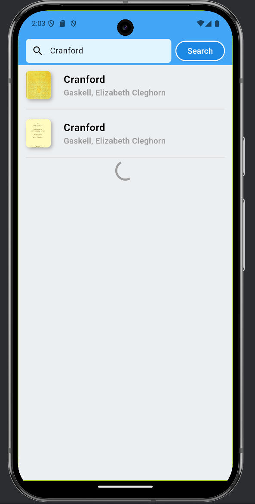

# Book Discovery App 📚

A Flutter application for exploring and searching books using the Gutendex API.

---

# Table of Contents
1. [Features](#features)
2. [Screenshots](#screenshots)
3. [Installation](#installation)
4. [Project Structure](#project-structure)
5. [Technologies Used](#technologies-used)

---

# Features
- **Search**: Find books by title or author or keyword.
- **Pagination**: Infinite scrolling for smooth browsing.
- **Navigation**: Click on a book to view its details.

---

# Screenshots
## Splash Screen


## Book List Screen (Home Page)
<p>
  
  
</p>

## Book Detail Screen
<p>
  
  
</p>

## Search Feature
<p>
  
  
</p>


---

# Installation
## Prerequisites
- Flutter SDK installed
- Dart installed
- Access to the Gutendex API

## Steps
1. Clone this repository:
   ```
   git clone https://github.com/ishitaathakre/BookDiscoveryApp.git
   cd BookDiscoveryApp
   ```

2. Install dependencies:
   ```
   flutter pub get
   ```

3. Run the app:
   ```
   flutter run
   ```

---

# Project Structure
```bash
lib/
├── main.dart               // Entry point of the application
├── splash.dart             // Splash screen of the app
├── home.dart               // Home page with book listing
├── api_calls.dart          // API-related functions
├── parse_book.dart         // Parsing logic for book data
├── book_details.dart       // Book details page
```

---

# Technologies Used

- **Flutter**
- **Dart**

